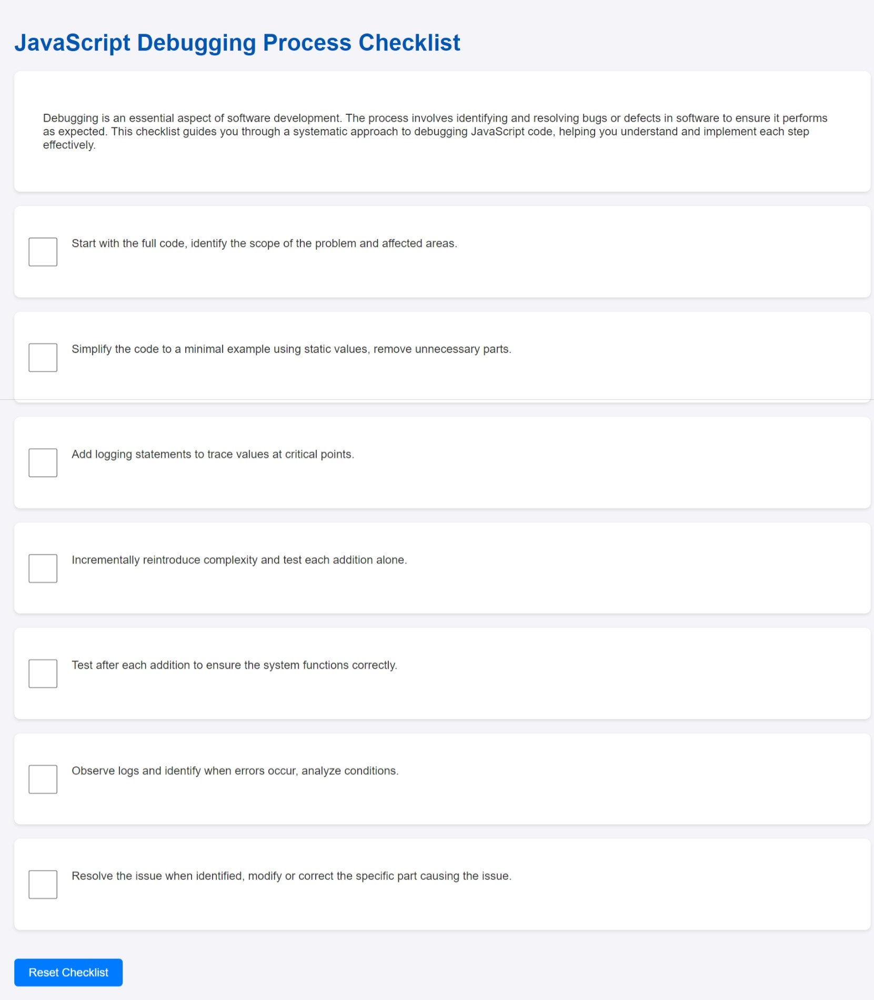

# JavaScript Debugging Checklist

Welcome to the JavaScript Debugging Checklist! This resource is designed to guide developers, especially beginners, through a structured approach to debugging JavaScript code.

## Introduction

Debugging is a critical skill in software development, essential for identifying and fixing bugs or issues in code. This checklist provides a step-by-step process to systematically debug JavaScript code, ensuring that each part of the process is understood and executed effectively.

## Features

- A comprehensive checklist for debugging JavaScript code.
- Each step is clearly described and marked with a checkbox.
- Simple and clear layout designed for ease of use.
- Reset button to clear all checked items for reuse.

## Screenshot

## How to Use

To use the checklist, simply visit the [GitHub Page](https://lesley-byte.github.io/DebuggingChecklist/).

- Start at the top of the checklist when you begin your debugging session.
- As you complete each step in your debugging process, check the box next to the corresponding step.
- If you need to start over or wish to use the checklist for a new debugging session, click the 'Reset Checklist' button at the bottom.

## Contributing

Contributions to the JavaScript Debugging Checklist are welcome! If you have suggestions for improvement or have found an issue, please feel free to contact me!

## License

This project is open-sourced under the MIT license. Feel free to fork the repository, make changes, and use it for your personal or professional projects.

## Acknowledgments

- Thanks to all contributors who have helped with writing, suggestions, and feedback.
- This checklist was inspired by common debugging practices and aims to support the developer community in problem-solving within JavaScript environments.
